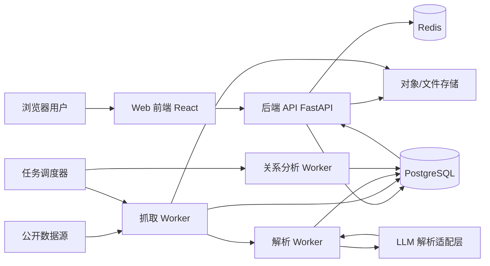
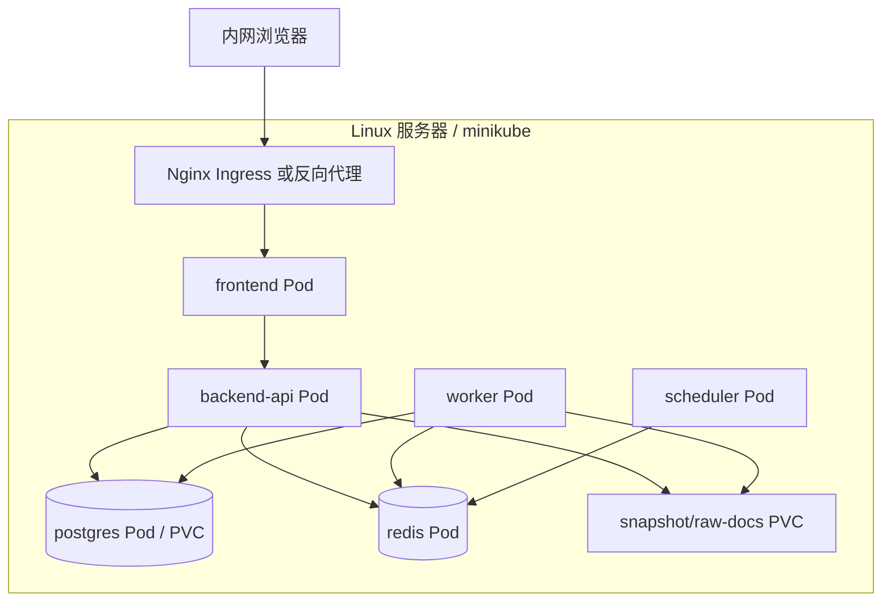
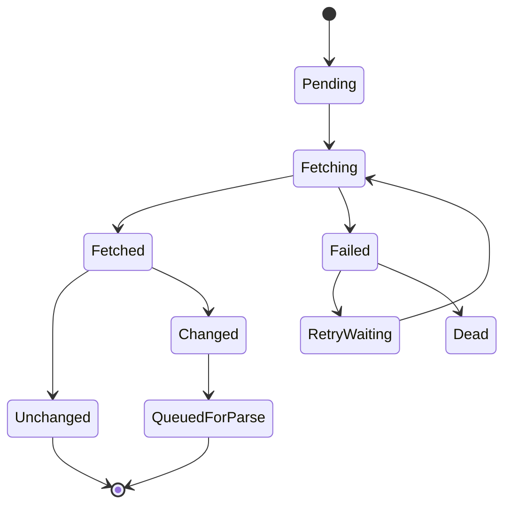
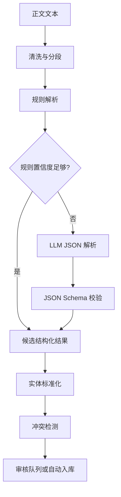

# 中国高级官员履历分析系统系统设计说明书

| 项目 | 内容 |
| --- | --- |
| 文档版本 | v0.1 |
| 编写日期 | 2026-06-11 |
| 关联文档 | 软件需求规格说明书.md |
| 系统名称 | Senior Official Profile Analysis System |
| 一期范围 | 从当前最近一届中国共产党中央委员会委员、候补委员开始建设 |
| 使用范围 | 个人内部研究使用，不面向公网开放 |

## 1. 设计目标

本文档在《软件需求规格说明书》的基础上，将需求转化为可落地的系统设计方案，明确系统架构、技术选型、模块职责、数据模型、接口设计、任务调度、关系分析算法、部署方案和安全设计。

一期建设目标：

1. 从当前最近一届中央委员会委员、候补委员开始采集和维护数据。
2. 支持公开履历的定期抓取、结构化解析、人工校验和版本追踪。
3. 使用大语言模型辅助履历文本解析，但解析结果必须经过结构化校验和置信度评估。
4. 使用 PostgreSQL 作为主数据库，并在一期使用关系边表实现图谱分析，不强制引入独立图数据库。
5. 支持管理员和普通用户两类权限。
6. 默认每周抓取更新，具体数据源可单独配置抓取频率。
7. 支持研究人员配置关系分析权重，系统提供默认权重模板。

## 2. 用户确认项落实

| 问题 | 用户确认 | 设计落实 |
| --- | --- | --- |
| 初始覆盖范围 | 从最近一届开始 | `committee_terms` 表维护届次，初始化时将最近一届设为 `is_current=true`。 |
| 使用范围 | 个人内部研究使用 | 默认部署在内网，不设计公网访问、公众注册和开放 API。 |
| 权限模型 | 区分管理员和普通用户 | 设计 `ADMIN`、`USER` 两类角色。 |
| LLM 辅助解析 | 允许 | 设计 LLM 解析适配层，输出 JSON 后进入校验和审核流程。 |
| 关系权重 | 研究人员可配置，系统提供默认权重 | 设计权重配置表和默认模板。 |
| 英文和其他国家扩展 | 暂不需要 | 一期仅中文界面和中国政治机构数据模型，但字段不硬编码国家。 |
| 图数据库 | 由系统设计决定 | 一期采用 PostgreSQL 边表；预留图数据库同步接口。 |
| 导出水印/脱敏 | 不需要 | 不设计水印和脱敏，但保留来源说明。 |
| 秘书等敏感关系 | 不默认隐藏 | 正常展示，但要求来源、置信度和审核状态。 |
| 抓取频率 | 默认每周，可配置 | 调度任务默认 weekly，支持按数据源覆盖。 |

## 3. 总体架构

### 3.1 架构风格

一期采用“模块化单体后端 + 异步任务 Worker + PostgreSQL + Redis + Web 前端”的架构。

选择理由：

1. 个人内部研究使用，不需要一开始拆分复杂微服务。
2. 数据规模预计在万级官员记录、十万到百万级履历事件内，PostgreSQL 足以支撑一期。
3. 抓取、解析、分析任务适合异步执行，避免阻塞 Web 请求。
4. 后续如果图谱查询复杂度显著提高，可将 PostgreSQL 中的关系边表同步到 Neo4j 或 NebulaGraph。

### 3.2 逻辑架构



### 3.3 部署架构



## 4. 技术选型

| 层级 | 选型 | 说明 |
| --- | --- | --- |
| 前端 | React + TypeScript + Vite | 开发效率高，适合复杂可视化界面。 |
| UI 组件 | Ant Design 或 Naive UI | 后台管理和表格场景成熟。 |
| 图谱可视化 | AntV G6 或 ECharts Graph | 支持节点、边、过滤、点击详情。 |
| 地图可视化 | ECharts Map | 一期先做省市级统计地图。 |
| 后端 | Python FastAPI | 适合文本解析、异步任务和快速 API 开发。 |
| ORM/迁移 | SQLAlchemy 2.x + Alembic | 数据模型和迁移可控。 |
| 数据库 | PostgreSQL 16+ | 主数据、关系边表、全文检索、JSONB。 |
| 缓存/队列 | Redis | 会话缓存、任务队列、短期结果缓存。 |
| 异步任务 | Celery | 抓取、解析、分析、重算任务。 |
| 抓取 | Requests + BeautifulSoup + Playwright | 静态页面用 Requests，动态页面用 Playwright。 |
| LLM 适配 | Provider Adapter | 封装不同模型供应商，统一 JSON 输出和重试。 |
| 认证 | JWT + HttpOnly Cookie | 内部系统足够轻量。 |
| 部署 | Docker + Kubernetes/minikube | 适配现有服务器能力。 |
| 日志 | structlog/loguru + JSON 日志 | 方便检索和排错。 |

## 5. 代码结构设计

建议仓库结构如下：

```text
SeniorOfficialProfileAnalysisSystem/
  docs/
    软件需求规格说明书.md
    系统设计说明书.md
  backend/
    app/
      main.py
      core/
        config.py
        security.py
        logging.py
      db/
        session.py
        models/
        migrations/
      modules/
        auth/
        officials/
        sources/
        crawler/
        parser/
        review/
        relationships/
        analysis/
        export/
        admin/
      workers/
        celery_app.py
        crawl_tasks.py
        parse_tasks.py
        analysis_tasks.py
      llm/
        adapter.py
        prompts/
        schemas.py
      tests/
  frontend/
    src/
      api/
      components/
      pages/
        Dashboard/
        Officials/
        OfficialDetail/
        RelationshipGraph/
        Analysis/
        Review/
        Admin/
      stores/
      routes/
      styles/
  deploy/
    docker-compose.yml
    k8s/
      backend.yaml
      frontend.yaml
      worker.yaml
      scheduler.yaml
      postgres.yaml
      redis.yaml
      ingress.yaml
  scripts/
    init_db.py
    import_committee_members.py
    backup_db.sh
```

说明：

1. `docs/` 保存需求和设计文档。
2. `backend/modules/` 按业务能力分包，保持模块化单体。
3. `backend/workers/` 放异步任务入口。
4. `backend/llm/` 只负责模型调用、提示词和结构化输出，不直接写正式业务表。
5. `deploy/` 保存容器和 Kubernetes 部署文件。

## 6. 后端模块设计

### 6.1 认证与权限模块

模块路径：`backend/app/modules/auth`

职责：

1. 用户登录、退出、刷新会话。
2. 密码哈希和校验。
3. JWT 签发与校验。
4. 管理员和普通用户权限控制。

角色设计：

| 角色 | 权限 |
| --- | --- |
| ADMIN | 用户管理、数据源配置、抓取任务管理、审核、编辑、删除、权重配置、分析、导出、查看日志。 |
| USER | 查看官员档案、检索、关系分析、查看来源、导出分析结果。 |

权限规则：

1. 只有 `ADMIN` 可以修改数据源、履历、关系、权重模板和用户。
2. `USER` 可以创建个人分析任务，但不能修改基础数据。
3. 所有写操作记录到 `audit_logs`。

### 6.2 官员档案模块

模块路径：`backend/app/modules/officials`

职责：

1. 官员列表检索。
2. 官员详情查询。
3. 履历时间线查询。
4. 教育经历、任职经历、来源证据聚合。
5. 管理员手工新增、编辑、合并官员。

核心服务：

| 服务 | 职责 |
| --- | --- |
| `OfficialService` | 官员基础档案 CRUD 和检索。 |
| `TimelineService` | 聚合履历事件并按时间排序。 |
| `ProfileMergeService` | 同名或重复官员合并。 |
| `EvidenceService` | 查询字段级证据链。 |

### 6.3 数据源与抓取模块

模块路径：`backend/app/modules/crawler`

职责：

1. 数据源配置管理。
2. 定时抓取任务生成。
3. 页面请求、限速、失败重试。
4. 正文抽取和原始快照保存。
5. 页面变化检测。

抓取策略：

1. 默认每周抓取一次。
2. 每个数据源可配置 `frequency_cron` 覆盖默认频率。
3. 使用 `content_hash` 判断页面是否变化。
4. 静态网页优先使用 Requests。
5. 动态网页或反爬较强页面使用 Playwright，但限制并发。
6. 每个数据源配置 `request_interval_seconds`，避免高频访问。

抓取状态机：



### 6.4 履历解析模块

模块路径：`backend/app/modules/parser`

职责：

1. 将抓取正文解析为结构化候选数据。
2. 规则解析和 LLM 解析协同。
3. 中文时间表达标准化。
4. 机构、职位、地点实体识别与标准化。
5. 输出候选官员、候选履历事件、候选关系线索。

解析流程：



设计原则：

1. 规则优先，LLM 辅助，不让 LLM 直接写正式表。
2. LLM 输出必须符合 JSON Schema。
3. 所有解析结果保留 `parser_version`、`prompt_version`、`model_name`、`raw_output_hash`。
4. 低置信度、冲突和新增关键关系进入审核队列。
5. 秘书/服务对象等关系不隐藏，但必须有来源和置信度。

LLM 输出示例结构：

```json
{
  "official": {
    "name": "姓名",
    "birth_date": "YYYY-MM",
    "birth_place": "省/市/县",
    "native_place": "省/市/县"
  },
  "career_events": [
    {
      "event_type": "education",
      "start_date": "YYYY-MM",
      "end_date": "YYYY-MM",
      "organization": "学校或机构",
      "position": null,
      "location": "地点",
      "description": "原文片段",
      "confidence": 0.86
    }
  ],
  "relationship_clues": [
    {
      "relationship_type": "secretary_to",
      "target_name": "姓名",
      "description": "原文片段",
      "confidence": 0.78
    }
  ]
}
```

### 6.5 审核模块

模块路径：`backend/app/modules/review`

职责：

1. 展示候选解析结果。
2. 支持管理员确认、修改、驳回、合并。
3. 处理多来源冲突。
4. 将审核通过的数据写入正式表。

审核策略：

| 场景 | 处理 |
| --- | --- |
| 高置信度、无冲突、来源可信等级 A/B | 可自动入库，并记录自动审核标记。 |
| 低置信度 | 进入待审核。 |
| 与现有数据冲突 | 进入冲突审核。 |
| 新增秘书/服务对象关系 | 默认进入待审核。 |
| 来源可信等级 C | 作为线索，进入待审核或等待交叉验证。 |

### 6.6 数据存储模块

模块路径：`backend/app/modules/sources`、`backend/app/db/models`

职责：

1. 管理正式结构化数据。
2. 管理原始来源、快照和证据。
3. 管理版本、审计和数据质量状态。

存储分层：

| 层级 | 表/存储 | 说明 |
| --- | --- | --- |
| 原始层 | `source_documents`、文件快照 | 保存 HTML、正文、哈希和抓取元数据。 |
| 候选层 | `candidate_*` 表 | 保存未审核解析结果。 |
| 标准层 | `officials`、`career_events` 等 | 保存审核后的正式数据。 |
| 图谱层 | `relationships`、`relationship_paths_cache` | 保存关系边和路径缓存。 |
| 审计层 | `audit_logs`、`data_change_logs` | 保存操作和数据变更记录。 |

### 6.7 关系分析模块

模块路径：`backend/app/modules/relationships`、`backend/app/modules/analysis`

职责：

1. 从履历事件生成关系边。
2. 根据权重配置计算关系强度。
3. 支持一度、二度、多跳路径分析。
4. 支持关系图谱查询。
5. 支持分析任务保存和重算。

一期关系分析基于 PostgreSQL：

1. `relationships` 表保存边。
2. `relationship_evidences` 表保存边的证据。
3. 多跳关系用递归 CTE 查询。
4. 常用一度关系、二度关系使用物化视图或缓存表。
5. 前端图谱直接消费节点和边数据。

不在一期引入独立图数据库的原因：

1. 个人内部研究场景下，部署和维护成本更重要。
2. 中央委员和候补委员规模有限，一期边表可以满足查询。
3. 关系计算规则仍在探索，关系型数据库更方便审计和调整。
4. 后续可通过 `graph_sync_jobs` 将边表同步到 Neo4j/NebulaGraph。

### 6.8 展示与导出模块

模块路径：`backend/app/modules/export`，前端 `frontend/src/pages`

职责：

1. 官员检索。
2. 官员详情页。
3. 履历时间线。
4. 关系图谱。
5. 分析任务视图。
6. CSV/Excel/Markdown/PDF 导出。

导出策略：

1. 不做水印。
2. 不做脱敏。
3. 导出文件必须包含数据生成时间、来源说明和分析限制说明。

## 7. 数据库设计

### 7.1 命名规范

1. 表名使用复数蛇形命名，如 `officials`。
2. 主键统一使用 `id`，类型建议 UUID。
3. 时间字段统一使用 `created_at`、`updated_at`。
4. 软删除字段使用 `deleted_at`。
5. 枚举字段优先使用字符串枚举，便于迁移和阅读。

### 7.2 核心表设计

#### 7.2.1 用户表 `users`

| 字段 | 类型 | 说明 |
| --- | --- | --- |
| id | uuid | 主键。 |
| username | varchar(64) | 登录名，唯一。 |
| password_hash | varchar(255) | 密码哈希。 |
| role | varchar(16) | `ADMIN` 或 `USER`。 |
| display_name | varchar(64) | 显示名。 |
| is_active | boolean | 是否启用。 |
| last_login_at | timestamptz | 最近登录时间。 |
| created_at | timestamptz | 创建时间。 |
| updated_at | timestamptz | 更新时间。 |

#### 7.2.2 届次表 `committee_terms`

| 字段 | 类型 | 说明 |
| --- | --- | --- |
| id | uuid | 主键。 |
| term_no | integer | 届次编号。 |
| name | varchar(128) | 届次名称，如“中国共产党第二十届中央委员会”。 |
| start_year | integer | 开始年份。 |
| end_year | integer | 结束年份，可空。 |
| is_current | boolean | 是否当前初始化目标届次。 |
| created_at | timestamptz | 创建时间。 |
| updated_at | timestamptz | 更新时间。 |

设计说明：一期初始化时将最近一届写入该表，并标记 `is_current=true`。具体届次不在代码中硬编码。

#### 7.2.3 官员表 `officials`

| 字段 | 类型 | 说明 |
| --- | --- | --- |
| id | uuid | 主键。 |
| name | varchar(64) | 标准姓名。 |
| name_pinyin | varchar(128) | 拼音，可选。 |
| aliases | jsonb | 曾用名、别名、不同写法。 |
| gender | varchar(16) | 性别。 |
| ethnicity | varchar(32) | 民族。 |
| birth_date | date | 出生日期，精度不足时使用约定补齐。 |
| birth_date_precision | varchar(16) | `year`、`month`、`day`、`unknown`。 |
| native_place_id | uuid | 籍贯地点。 |
| birth_place_id | uuid | 出生地。 |
| current_status | varchar(32) | 在任、退休、去世、未知。 |
| profile_photo_url | text | 公开照片 URL。 |
| profile_summary | text | 简介摘要。 |
| data_quality_score | numeric(5,2) | 数据质量评分。 |
| review_status | varchar(32) | 审核状态。 |
| created_at | timestamptz | 创建时间。 |
| updated_at | timestamptz | 更新时间。 |
| deleted_at | timestamptz | 软删除。 |

#### 7.2.4 官员届次关系表 `official_term_memberships`

| 字段 | 类型 | 说明 |
| --- | --- | --- |
| id | uuid | 主键。 |
| official_id | uuid | 官员 ID。 |
| term_id | uuid | 届次 ID。 |
| membership_type | varchar(32) | `member` 或 `alternate_member`。 |
| rank_order | integer | 名单顺序，可选。 |
| source_document_id | uuid | 来源。 |
| created_at | timestamptz | 创建时间。 |

#### 7.2.5 地点表 `locations`

| 字段 | 类型 | 说明 |
| --- | --- | --- |
| id | uuid | 主键。 |
| name | varchar(128) | 地点名称。 |
| full_name | varchar(255) | 完整名称。 |
| country | varchar(64) | 国家。 |
| province | varchar(64) | 省级行政区。 |
| city | varchar(64) | 市。 |
| county | varchar(64) | 县区。 |
| level | varchar(32) | `country`、`province`、`city`、`county` 等。 |
| parent_id | uuid | 上级地点。 |
| longitude | numeric(10,6) | 经度。 |
| latitude | numeric(10,6) | 纬度。 |
| aliases | jsonb | 别名。 |

#### 7.2.6 机构表 `organizations`

| 字段 | 类型 | 说明 |
| --- | --- | --- |
| id | uuid | 主键。 |
| name | varchar(255) | 标准机构名。 |
| full_name | varchar(512) | 完整机构名。 |
| org_type | varchar(64) | 党政机关、学校、企业、军队、媒体等。 |
| parent_id | uuid | 上级机构。 |
| location_id | uuid | 所在地点。 |
| valid_from | date | 有效起始日期。 |
| valid_to | date | 有效结束日期。 |
| aliases | jsonb | 别名和历史名称。 |
| created_at | timestamptz | 创建时间。 |
| updated_at | timestamptz | 更新时间。 |

#### 7.2.7 职位表 `positions`

| 字段 | 类型 | 说明 |
| --- | --- | --- |
| id | uuid | 主键。 |
| name | varchar(255) | 职位名称。 |
| normalized_name | varchar(255) | 标准职位名称。 |
| organization_id | uuid | 所属机构，可空。 |
| rank_level | varchar(64) | 级别，如正省部级、副省部级等。 |
| position_type | varchar(64) | 党内、行政、人大、政协、军队、教育等。 |
| aliases | jsonb | 别名。 |

#### 7.2.8 履历事件表 `career_events`

| 字段 | 类型 | 说明 |
| --- | --- | --- |
| id | uuid | 主键。 |
| official_id | uuid | 官员 ID。 |
| event_type | varchar(64) | `birth`、`education`、`appointment`、`transfer`、`part_time_study` 等。 |
| start_date | date | 开始日期。 |
| end_date | date | 结束日期。 |
| start_precision | varchar(16) | 年、月、日、不确定。 |
| end_precision | varchar(16) | 年、月、日、不确定。 |
| organization_id | uuid | 机构。 |
| position_id | uuid | 职位。 |
| location_id | uuid | 地点。 |
| description | text | 标准化描述。 |
| original_text | text | 原文片段。 |
| is_concurrent | boolean | 是否兼任或并行经历。 |
| confidence | numeric(4,3) | 置信度。 |
| review_status | varchar(32) | 审核状态。 |
| data_version | integer | 数据版本。 |
| created_at | timestamptz | 创建时间。 |
| updated_at | timestamptz | 更新时间。 |
| deleted_at | timestamptz | 软删除。 |

#### 7.2.9 来源文档表 `source_documents`

| 字段 | 类型 | 说明 |
| --- | --- | --- |
| id | uuid | 主键。 |
| source_config_id | uuid | 数据源配置 ID。 |
| url | text | 来源 URL。 |
| title | text | 页面标题。 |
| publisher | varchar(255) | 发布机构。 |
| published_at | timestamptz | 发布时间。 |
| fetched_at | timestamptz | 抓取时间。 |
| http_status | integer | HTTP 状态码。 |
| content_hash | varchar(128) | 正文哈希。 |
| raw_html_path | text | HTML 快照路径。 |
| plain_text_path | text | 正文快照路径。 |
| trust_level | varchar(8) | A/B/C/D。 |
| parse_status | varchar(32) | 未解析、已解析、失败等。 |
| created_at | timestamptz | 创建时间。 |

#### 7.2.10 证据表 `evidences`

| 字段 | 类型 | 说明 |
| --- | --- | --- |
| id | uuid | 主键。 |
| entity_type | varchar(64) | `official`、`career_event`、`relationship` 等。 |
| entity_id | uuid | 目标实体 ID。 |
| field_name | varchar(128) | 字段名，可空。 |
| source_document_id | uuid | 来源文档。 |
| quote_text | text | 原文摘录。 |
| confidence | numeric(4,3) | 证据置信度。 |
| created_at | timestamptz | 创建时间。 |

#### 7.2.11 关系表 `relationships`

| 字段 | 类型 | 说明 |
| --- | --- | --- |
| id | uuid | 主键。 |
| subject_official_id | uuid | 主体官员。 |
| object_official_id | uuid | 客体官员。 |
| relationship_type | varchar(64) | 关系类型。 |
| start_date | date | 关系开始时间。 |
| end_date | date | 关系结束时间。 |
| strength_score | numeric(8,3) | 关系强度分。 |
| confidence | numeric(4,3) | 置信度。 |
| is_inferred | boolean | 是否推断关系。 |
| evidence_summary | text | 证据摘要。 |
| weight_profile_id | uuid | 使用的权重配置。 |
| review_status | varchar(32) | 审核状态。 |
| created_at | timestamptz | 创建时间。 |
| updated_at | timestamptz | 更新时间。 |

约束：

1. `subject_official_id` 和 `object_official_id` 不得相同。
2. 对无方向关系，按 UUID 排序存储，避免重复。
3. 对有方向关系，如秘书关系、上下级关系，按实际方向存储。

#### 7.2.12 关系权重配置表 `relationship_weight_profiles`

| 字段 | 类型 | 说明 |
| --- | --- | --- |
| id | uuid | 主键。 |
| name | varchar(128) | 权重方案名称。 |
| is_default | boolean | 是否系统默认。 |
| created_by | uuid | 创建人。 |
| created_at | timestamptz | 创建时间。 |
| updated_at | timestamptz | 更新时间。 |

#### 7.2.13 关系权重项表 `relationship_weight_items`

| 字段 | 类型 | 说明 |
| --- | --- | --- |
| id | uuid | 主键。 |
| profile_id | uuid | 权重方案 ID。 |
| relationship_type | varchar(64) | 关系类型。 |
| base_weight | numeric(8,3) | 基础权重。 |
| time_decay_enabled | boolean | 是否启用时间衰减。 |
| max_score | numeric(8,3) | 单类关系最高分。 |
| description | text | 说明。 |

#### 7.2.14 数据源配置表 `source_configs`

| 字段 | 类型 | 说明 |
| --- | --- | --- |
| id | uuid | 主键。 |
| name | varchar(255) | 数据源名称。 |
| base_url | text | 基础 URL。 |
| source_type | varchar(64) | 官方网站、新闻、百科等。 |
| trust_level | varchar(8) | A/B/C/D。 |
| crawl_strategy | varchar(64) | requests、playwright、manual_import。 |
| frequency_cron | varchar(64) | 抓取频率，默认每周。 |
| request_interval_seconds | integer | 请求间隔。 |
| max_retry | integer | 最大重试次数。 |
| is_enabled | boolean | 是否启用。 |
| created_at | timestamptz | 创建时间。 |
| updated_at | timestamptz | 更新时间。 |

#### 7.2.15 候选解析结果表

候选层建议使用三张表：

1. `candidate_officials`
2. `candidate_career_events`
3. `candidate_relationships`

共同字段：

| 字段 | 类型 | 说明 |
| --- | --- | --- |
| id | uuid | 主键。 |
| source_document_id | uuid | 来源文档。 |
| payload | jsonb | 解析出的结构化 JSON。 |
| parser_type | varchar(32) | rule、llm、hybrid。 |
| parser_version | varchar(64) | 解析器版本。 |
| prompt_version | varchar(64) | LLM 提示词版本。 |
| model_name | varchar(128) | 模型名称。 |
| confidence | numeric(4,3) | 置信度。 |
| review_status | varchar(32) | 待审核、通过、驳回、冲突。 |
| reviewed_by | uuid | 审核人。 |
| reviewed_at | timestamptz | 审核时间。 |
| created_at | timestamptz | 创建时间。 |

#### 7.2.16 分析任务表 `analysis_tasks`

| 字段 | 类型 | 说明 |
| --- | --- | --- |
| id | uuid | 主键。 |
| name | varchar(255) | 任务名称。 |
| task_type | varchar(64) | pair、ego_network、group_cluster 等。 |
| created_by | uuid | 创建人。 |
| parameters | jsonb | 分析参数。 |
| weight_profile_id | uuid | 权重方案。 |
| status | varchar(32) | pending、running、success、failed。 |
| result_summary | jsonb | 结果摘要。 |
| data_version | integer | 使用的数据版本。 |
| started_at | timestamptz | 开始时间。 |
| finished_at | timestamptz | 完成时间。 |
| created_at | timestamptz | 创建时间。 |

#### 7.2.17 审计日志表 `audit_logs`

| 字段 | 类型 | 说明 |
| --- | --- | --- |
| id | uuid | 主键。 |
| user_id | uuid | 操作人。 |
| action | varchar(128) | 操作类型。 |
| entity_type | varchar(64) | 实体类型。 |
| entity_id | uuid | 实体 ID。 |
| before_value | jsonb | 修改前。 |
| after_value | jsonb | 修改后。 |
| ip_address | varchar(64) | 来源 IP。 |
| user_agent | text | User Agent。 |
| created_at | timestamptz | 创建时间。 |

### 7.3 关键索引

```sql
CREATE INDEX idx_officials_name ON officials (name);
CREATE INDEX idx_officials_birth_place ON officials (birth_place_id);
CREATE INDEX idx_career_events_official_time ON career_events (official_id, start_date, end_date);
CREATE INDEX idx_career_events_org_time ON career_events (organization_id, start_date, end_date);
CREATE INDEX idx_career_events_location_time ON career_events (location_id, start_date, end_date);
CREATE INDEX idx_relationships_subject ON relationships (subject_official_id);
CREATE INDEX idx_relationships_object ON relationships (object_official_id);
CREATE INDEX idx_relationships_type_score ON relationships (relationship_type, strength_score DESC);
CREATE INDEX idx_source_documents_hash ON source_documents (content_hash);
CREATE INDEX idx_evidences_entity ON evidences (entity_type, entity_id);
```

全文检索建议：

1. `officials.name`、`officials.aliases` 用普通索引和 trigram 索引。
2. `career_events.description`、`source_documents.title` 可建立 PostgreSQL full text search。
3. 中文分词可后续引入 OpenSearch，一期先用 `pg_trgm` 和简单关键词检索。

## 8. 关系分析设计

### 8.1 关系类型

一期支持以下关系类型：

| 类型 | 方向 | 是否推断 | 说明 |
| --- | --- | --- | --- |
| same_native_place | 无方向 | 是 | 籍贯相同。 |
| same_birth_place | 无方向 | 是 | 出生地相同。 |
| same_school | 无方向 | 是 | 曾在同一学校学习。 |
| same_major_same_period | 无方向 | 是 | 同专业且学习时间重叠。 |
| same_organization_overlap | 无方向 | 是 | 同机构任职时间重叠。 |
| same_location_overlap | 无方向 | 是 | 同地区任职时间重叠。 |
| superior_subordinate | 有方向 | 部分推断 | 同机构或公开资料显示上下级。 |
| secretary_to | 有方向 | 否/低推断 | 公开来源明确描述秘书关系。 |
| predecessor_successor | 有方向 | 是 | 同一职位前后任。 |
| same_committee_term | 无方向 | 否 | 同一届中央委员会。 |

### 8.2 默认权重模板

系统初始化时创建 `default` 权重方案：

| 关系类型 | 默认基础权重 | 单类最高分 |
| --- | --- | --- |
| secretary_to | 90 | 100 |
| superior_subordinate | 80 | 100 |
| same_organization_overlap | 60 | 90 |
| same_location_overlap | 45 | 70 |
| same_major_same_period | 45 | 70 |
| predecessor_successor | 35 | 60 |
| same_school | 25 | 50 |
| same_native_place | 20 | 40 |
| same_birth_place | 20 | 40 |
| same_committee_term | 10 | 25 |

研究人员可在管理界面复制默认模板并调整权重。调整后不会覆盖历史分析任务，历史任务保留当时使用的 `weight_profile_id`。

### 8.3 时间重叠计算

对两个履历事件计算时间重叠：

```text
overlap_days = max(0, min(a.end_date, b.end_date) - max(a.start_date, b.start_date))
duration_factor =
  0.2, overlap_days < 90
  0.5, 90 <= overlap_days < 365
  0.8, 365 <= overlap_days < 1095
  1.0, overlap_days >= 1095
```

如果时间精度只有年份或月份，系统按精度补齐日期，并降低置信度。

### 8.4 关系边评分公式

单条关系边建议评分：

```text
edge_score = min(
  max_score,
  base_weight * duration_factor * source_factor * confidence_factor
)
```

其中：

1. `base_weight` 来自权重配置。
2. `duration_factor` 来自时间重叠或关系持续时间。
3. `source_factor` 根据来源可信等级计算，A=1.0，B=0.85，C=0.6，D=0.3。
4. `confidence_factor` 为解析置信度和审核状态的组合，人工确认可设为 1.0。

两名官员存在多条关系时，综合评分：

```text
total_score = 100 * (1 - product(1 - edge_score_i / 100))
```

这样可以累积多种关系，同时避免简单相加超过 100。

### 8.5 路径分析

路径查询分三类：

1. 一度关系：直接边。
2. 二度关系：A -> X -> B。
3. 多跳关系：最多 3 跳，一期默认不超过 3 跳，避免解释性变差。

路径评分：

```text
path_score = min(edge_score_1, edge_score_2, ..., edge_score_n) * path_decay
path_decay = 1.0 for 1 hop, 0.65 for 2 hops, 0.4 for 3 hops
```

展示时必须展示路径节点、边类型和证据摘要。

### 8.6 重算机制

触发关系重算的场景：

1. 官员基础信息变更。
2. 履历事件新增、修改、删除。
3. 机构、地点、职位标准化映射变更。
4. 权重方案变更。
5. 用户手工触发重算。

重算策略：

1. 数据变更后只重算受影响官员的一度关系。
2. 夜间或每周执行全量关系重算。
3. 分析任务保留数据版本，底层数据更新后标记为可能过期。

## 9. LLM 辅助解析设计

### 9.1 适配层

`LLMAdapter` 提供统一接口：

```python
class LLMAdapter:
    def extract_profile(self, text: str, schema: dict, prompt_version: str) -> dict:
        ...
```

适配层职责：

1. 组装提示词。
2. 调用模型。
3. 解析 JSON。
4. 执行 JSON Schema 校验。
5. 记录调用元数据。
6. 对失败调用进行有限重试。

### 9.2 提示词版本管理

提示词保存在：

```text
backend/app/llm/prompts/profile_extract_v1.md
backend/app/llm/prompts/relationship_clue_extract_v1.md
```

每次 LLM 调用记录：

1. `prompt_version`
2. `model_name`
3. `input_hash`
4. `output_hash`
5. `temperature`
6. `schema_version`
7. `latency_ms`
8. `error_message`

### 9.3 校验规则

LLM 输出入库前必须通过：

1. JSON Schema 校验。
2. 日期格式校验。
3. 官员姓名一致性校验。
4. 机构和地点字典匹配。
5. 置信度范围校验。
6. 原文摘录存在性校验。

未通过校验的结果写入候选表，并标记为 `parse_failed` 或 `needs_review`。

### 9.4 成本与速率控制

1. 只对规则解析失败或低置信度文本调用 LLM。
2. 对相同 `content_hash` 不重复调用 LLM。
3. 支持每日调用上限和并发上限。
4. 管理员可关闭 LLM 解析。

## 10. API 设计

### 10.1 认证

| 方法 | 路径 | 权限 | 说明 |
| --- | --- | --- | --- |
| POST | `/api/auth/login` | 匿名 | 登录。 |
| POST | `/api/auth/logout` | 登录用户 | 退出。 |
| GET | `/api/auth/me` | 登录用户 | 当前用户信息。 |

### 10.2 官员档案

| 方法 | 路径 | 权限 | 说明 |
| --- | --- | --- | --- |
| GET | `/api/officials` | USER | 检索官员。 |
| POST | `/api/officials` | ADMIN | 新增官员。 |
| GET | `/api/officials/{id}` | USER | 官员详情。 |
| PATCH | `/api/officials/{id}` | ADMIN | 修改官员。 |
| GET | `/api/officials/{id}/timeline` | USER | 履历时间线。 |
| GET | `/api/officials/{id}/evidences` | USER | 来源证据。 |
| POST | `/api/officials/merge` | ADMIN | 合并官员。 |

### 10.3 数据源与抓取

| 方法 | 路径 | 权限 | 说明 |
| --- | --- | --- | --- |
| GET | `/api/sources/configs` | ADMIN | 数据源配置列表。 |
| POST | `/api/sources/configs` | ADMIN | 新增数据源。 |
| PATCH | `/api/sources/configs/{id}` | ADMIN | 修改数据源。 |
| POST | `/api/crawl/jobs` | ADMIN | 手工创建抓取任务。 |
| GET | `/api/crawl/jobs` | ADMIN | 抓取任务列表。 |
| GET | `/api/crawl/jobs/{id}` | ADMIN | 抓取任务详情。 |

### 10.4 审核

| 方法 | 路径 | 权限 | 说明 |
| --- | --- | --- | --- |
| GET | `/api/review/items` | ADMIN | 待审核列表。 |
| GET | `/api/review/items/{id}` | ADMIN | 审核详情。 |
| POST | `/api/review/items/{id}/approve` | ADMIN | 审核通过。 |
| POST | `/api/review/items/{id}/reject` | ADMIN | 驳回。 |
| POST | `/api/review/items/{id}/resolve-conflict` | ADMIN | 解决冲突。 |

### 10.5 关系与分析

| 方法 | 路径 | 权限 | 说明 |
| --- | --- | --- | --- |
| GET | `/api/officials/{id}/relationships` | USER | 官员关系列表。 |
| GET | `/api/relationships/graph` | USER | 图谱节点和边。 |
| GET | `/api/relationships/path` | USER | 两名官员关系路径。 |
| GET | `/api/weight-profiles` | USER | 权重方案列表。 |
| POST | `/api/weight-profiles` | ADMIN | 创建权重方案。 |
| PATCH | `/api/weight-profiles/{id}` | ADMIN | 修改权重方案。 |
| POST | `/api/analysis/tasks` | USER | 创建分析任务。 |
| GET | `/api/analysis/tasks` | USER | 分析任务列表。 |
| GET | `/api/analysis/tasks/{id}` | USER | 分析结果。 |

### 10.6 导出

| 方法 | 路径 | 权限 | 说明 |
| --- | --- | --- | --- |
| GET | `/api/export/officials/{id}.md` | USER | 导出单人 Markdown 履历。 |
| GET | `/api/export/relationships.csv` | USER | 导出关系边列表。 |
| GET | `/api/export/analysis/{id}.pdf` | USER | 导出分析报告。 |

## 11. 前端设计

### 11.1 路由

| 路由 | 页面 | 权限 |
| --- | --- | --- |
| `/login` | 登录页 | 匿名 |
| `/` | 工作台 | USER |
| `/officials` | 官员检索 | USER |
| `/officials/:id` | 官员详情 | USER |
| `/relationships` | 关系图谱 | USER |
| `/analysis` | 分析任务 | USER |
| `/review` | 数据审核 | ADMIN |
| `/admin/sources` | 数据源管理 | ADMIN |
| `/admin/weights` | 权重配置 | ADMIN |
| `/admin/users` | 用户管理 | ADMIN |
| `/admin/jobs` | 任务监控 | ADMIN |

### 11.2 页面设计

#### 工作台

展示：

1. 官员数量。
2. 履历事件数量。
3. 关系边数量。
4. 来源文档数量。
5. 最近一次抓取时间。
6. 待审核数量。
7. 最近失败任务。

#### 官员检索页

能力：

1. 按姓名、届次、委员类型、籍贯、出生地、学校、机构、职位、地区筛选。
2. 支持表格和卡片两种视图。
3. 支持导出检索结果。

#### 官员详情页

页面结构：

1. 顶部基础信息。
2. 左侧履历时间线。
3. 右侧关系摘要。
4. 教育经历表。
5. 任职经历表。
6. 来源证据面板。
7. 数据质量和冲突提示。

#### 关系图谱页

能力：

1. 选择中心官员。
2. 筛选关系类型、时间范围、最小分数、最大跳数。
3. 节点大小表示关联强度。
4. 边颜色表示关系类型。
5. 点击边展示证据链和评分构成。

#### 权重配置页

能力：

1. 查看系统默认权重。
2. 复制默认权重为自定义方案。
3. 修改关系类型权重。
4. 标记某个方案为分析默认方案。

## 12. 任务调度设计

### 12.1 周期任务

| 任务 | 默认频率 | 说明 |
| --- | --- | --- |
| `weekly_crawl_sources` | 每周 | 根据数据源配置生成抓取任务。 |
| `daily_retry_failed_jobs` | 每日 | 重试可恢复失败任务。 |
| `weekly_relationship_rebuild` | 每周 | 全量重算关系边。 |
| `daily_data_quality_check` | 每日 | 计算数据质量和缺失项。 |
| `weekly_backup` | 每周 | 数据库和快照备份。 |

### 12.2 Celery 队列

| 队列 | 任务类型 |
| --- | --- |
| `crawl` | 网页抓取、快照保存。 |
| `parse` | 文本解析、LLM 调用。 |
| `review` | 自动入库、冲突检测。 |
| `analysis` | 关系重算、路径分析。 |
| `export` | PDF/Excel 导出。 |

### 12.3 失败处理

1. 网络超时重试 3 次。
2. HTTP 4xx 不自动重试，记录失败。
3. HTTP 5xx 按指数退避重试。
4. LLM 调用失败重试 2 次。
5. 解析失败进入人工审核队列。

## 13. 安全设计

### 13.1 访问边界

1. 系统默认只绑定内网地址。
2. 不开放公网注册。
3. 管理员手工创建用户。
4. 部署凭据、数据库密码、LLM API Key 通过环境变量或 Kubernetes Secret 管理。
5. 不将服务器密码、API Key、Cookie 写入仓库和日志。

### 13.2 认证与会话

1. 用户密码使用 bcrypt 或 argon2 哈希。
2. 登录成功后通过 HttpOnly Cookie 保存 JWT。
3. JWT 设置过期时间。
4. 管理员可禁用用户。

### 13.3 操作审计

记录以下操作：

1. 登录和退出。
2. 新增、修改、删除官员。
3. 审核通过、驳回和冲突解决。
4. 数据源配置变更。
5. 权重配置变更。
6. 导出操作。
7. 手工触发抓取或分析任务。

### 13.4 Web 安全

1. SQL 使用 ORM 参数化查询。
2. 前端默认转义用户可控文本。
3. 管理接口检查角色。
4. 上传文件限制类型和大小。
5. 对外部 URL 抓取做协议和域名校验，防止 SSRF。

## 14. 数据质量设计

### 14.1 数据状态

| 状态 | 说明 |
| --- | --- |
| `draft` | 手工草稿或导入初始数据。 |
| `pending_review` | 待审核。 |
| `verified` | 已确认。 |
| `conflicted` | 存在冲突。 |
| `rejected` | 已驳回。 |
| `archived` | 历史归档。 |

### 14.2 完整度评分

个人履历完整度评分由以下部分组成：

| 项 | 权重 |
| --- | --- |
| 基础身份字段完整 | 20 |
| 教育经历完整 | 15 |
| 主要任职经历完整 | 30 |
| 时间线缺口少 | 15 |
| 来源覆盖充分 | 15 |
| 冲突少 | 5 |

总分 100。低于 60 的官员在工作台提示需要补充。

### 14.3 冲突检测

冲突场景：

1. 不同来源给出不同出生年月。
2. 同一时间段出现互斥职位。
3. 同一职位起止时间差异较大。
4. 机构或地点标准化结果不一致。
5. 关系方向冲突，如 A 是 B 秘书和 B 是 A 秘书同时出现。

处理：

1. 标记正式数据为 `conflicted`。
2. 生成审核任务。
3. 保留多个候选值和来源。
4. 管理员选择主值或保留不确定状态。

## 15. 部署设计

### 15.1 Docker 服务

一期建议先提供 Docker Compose，随后部署到 minikube。

服务列表：

| 服务 | 说明 |
| --- | --- |
| `frontend` | React 静态资源服务。 |
| `backend-api` | FastAPI 服务。 |
| `worker` | Celery Worker。 |
| `scheduler` | Celery Beat 或 APScheduler。 |
| `postgres` | PostgreSQL 数据库。 |
| `redis` | Redis 队列和缓存。 |
| `nginx` | 反向代理。 |

### 15.2 Kubernetes 资源

| 资源 | 说明 |
| --- | --- |
| Deployment/backend-api | 后端 API。 |
| Deployment/frontend | 前端。 |
| Deployment/worker | 异步 Worker。 |
| Deployment/scheduler | 周期任务。 |
| StatefulSet/postgres | 数据库。 |
| Deployment/redis | Redis。 |
| PVC/postgres-data | 数据库存储。 |
| PVC/raw-docs | 原始页面快照。 |
| Secret/app-secrets | 数据库密码、JWT 密钥、LLM Key。 |
| ConfigMap/app-config | 非敏感配置。 |
| Ingress 或 NodePort | 内网访问入口。 |

### 15.3 环境变量

| 变量 | 说明 |
| --- | --- |
| `APP_ENV` | dev、test、prod。 |
| `DATABASE_URL` | PostgreSQL 连接串。 |
| `REDIS_URL` | Redis 连接串。 |
| `JWT_SECRET` | JWT 密钥。 |
| `LLM_PROVIDER` | LLM 供应商标识。 |
| `LLM_API_KEY` | LLM API Key。 |
| `DEFAULT_CRAWL_CRON` | 默认抓取周期，默认每周。 |
| `RAW_DOCS_DIR` | 原始快照目录。 |
| `LOG_LEVEL` | 日志级别。 |

## 16. 备份与恢复

### 16.1 备份内容

1. PostgreSQL 数据库。
2. 原始 HTML 和正文快照。
3. 上传文件。
4. 部署配置中非敏感部分。

### 16.2 备份策略

1. 每周全量备份。
2. 重要导入或大规模重算前手工备份。
3. 备份文件保留最近 8 份。
4. 恢复流程至少每季度演练一次。

## 17. 测试设计

### 17.1 后端测试

| 类型 | 覆盖内容 |
| --- | --- |
| 单元测试 | 时间解析、关系评分、权重计算、数据标准化。 |
| 集成测试 | API、数据库、审核流程、任务队列。 |
| 解析测试 | 使用固定履历文本验证结构化输出。 |
| 权限测试 | ADMIN 和 USER 的访问边界。 |
| 安全测试 | SQL 注入、越权、SSRF URL 校验。 |

### 17.2 前端测试

| 类型 | 覆盖内容 |
| --- | --- |
| 组件测试 | 检索表格、时间线、关系图详情面板。 |
| 页面测试 | 登录、官员详情、分析任务、审核页。 |
| 可视化测试 | 节点边渲染、筛选、点击详情。 |

### 17.3 验收测试

一期验收用例：

1. 导入最近一届中央委员和候补委员名单。
2. 抓取至少 100 名官员公开履历。
3. 解析并生成结构化履历事件。
4. 管理员审核候选数据。
5. 普通用户检索官员并查看详情。
6. 生成某官员的一度关系图谱。
7. 调整权重方案并重新运行分析任务。
8. 导出分析报告。

## 18. 开发里程碑

| 阶段 | 目标 | 交付物 |
| --- | --- | --- |
| D1 项目骨架 | 建立前后端、数据库、部署骨架 | FastAPI、React、PostgreSQL、Redis、Docker Compose |
| D2 数据模型 | 完成核心表、迁移和基础 CRUD | Alembic 迁移、模型、种子数据 |
| D3 官员档案 | 完成官员检索、详情、时间线 | API 和前端页面 |
| D4 抓取解析 | 完成数据源配置、抓取、规则解析、LLM 辅助解析 | Worker、候选表、审核队列 |
| D5 审核入库 | 完成冲突检测、审核、正式入库 | 审核页面、审计日志 |
| D6 关系分析 | 完成关系边生成、权重配置、路径分析 | 关系服务、分析任务 |
| D7 可视化导出 | 完成图谱展示、报表导出 | 图谱页、导出接口 |
| D8 部署验收 | 部署到服务器，完成备份、测试和验收 | k8s 清单、测试报告 |

## 19. 后续扩展预留

1. 接入 Neo4j/NebulaGraph：通过关系边表增量同步。
2. 接入 OpenSearch：增强中文全文检索。
3. 增加实体消歧模型：提高同名官员、机构别名识别准确率。
4. 增加时间线缺口自动提示。
5. 增加更复杂的群体聚类算法。
6. 增加多届中央委员会纵向对比。
7. 增加多语言界面和其他国家数据模型。

## 20. 关键设计决策总结

1. 一期采用 PostgreSQL 关系边表，不引入独立图数据库。
2. 架构采用模块化单体，抓取、解析、分析通过 Celery 异步执行。
3. 默认每周抓取，按数据源可配置。
4. LLM 只做辅助解析，结果必须校验和审核。
5. 关系分析权重可配置，默认模板初始化入库。
6. 权限只区分管理员和普通用户，符合个人内部研究场景。
7. 数据导出不做水印和脱敏，但保留来源与免责声明。
8. 秘书等敏感关系不默认隐藏，但要求来源、置信度和审核状态。
9. 系统不面向公网开放，所有密钥和凭据通过 Secret 或环境变量管理。

