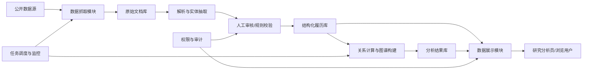

# 中国高级官员履历分析系统软件需求规格说明书

| 项目 | 内容 |
| --- | --- |
| 文档版本 | v0.1 |
| 编写日期 | 2026-06-10 |
| 适用阶段 | 原型设计、一期需求澄清、架构设计输入 |
| 系统名称 | Senior Official Profile Analysis System |
| 目标范围 | 中国共产党中央委员会委员、候补委员；架构预留扩展到其他国家或组织体系 |

## 1. 引言

### 1.1 编写目的

本文档用于明确“中国高级官员履历分析系统”的建设目标、业务范围、功能需求、数据需求、非功能需求、接口需求、合规要求和验收标准，为后续产品设计、系统架构、数据库建模、开发排期、测试验收提供依据。

### 1.2 项目背景

高级官员的公开履历中包含出生信息、籍贯/出生地、教育经历、工作经历、任职地点、组织关系、同事关系、上下级关系、秘书/服务对象关系等信息。这些信息分散在官方网站、新闻报道、机构公告、百科类页面、地方政府网站、干部任免公告等来源中，格式不统一，更新不及时，难以进行系统化检索、结构化分析和可视化呈现。

本系统旨在基于公开来源，建立可追溯、可更新、可分析、可可视化的高级官员履历数据库，并支持对官员之间的交集、共事、同乡、同学、上下级、同机构、同地域任职等关系进行分析。

### 1.3 术语定义

| 术语 | 定义 |
| --- | --- |
| 高级官员 | 本系统一期中特指中国共产党中央委员会委员和候补委员。 |
| 官员履历 | 某一官员从出生、教育到各阶段任职的时间序列化经历。 |
| 履历事件 | 官员在某一时间段内发生的结构化经历，如学习、任职、调任、兼任、免职、退休等。 |
| 关系 | 两名或多名官员之间基于公开履历推导出的关联，如同乡、同学、同事、上下级、秘书关系等。 |
| 同盟分析 | 基于公开履历与结构化关系进行的关联强度、群体聚类和可能协作关系分析。系统仅输出分析依据、评分和假设，不直接给出未经证实的事实断言。 |
| 证据链 | 支撑某条履历或关系记录的来源链接、原文摘录、抓取时间、解析规则、置信度等信息。 |

### 1.4 参考原则

1. 仅采集、存储和分析公开来源信息。
2. 每条关键履历和关系必须保留来源与证据链。
3. 分析结论必须带有置信度、来源依据和不确定性说明。
4. 系统应避免将推断性关系表述为事实。
5. 数据模型应支持未来扩展到其他国家、其他政党/组织、其他届次或历史人物。

## 2. 总体描述

### 2.1 产品定位

本系统是一个面向研究、资料整理和关系分析的履历知识库系统，核心能力包括：

1. 自动或半自动抓取公开履历信息。
2. 将非结构化文本转换为结构化履历事件。
3. 存储官员、机构、职位、地点、时间、来源、关系等数据。
4. 基于规则、图谱和模型进行关系分析。
5. 通过时间线、关系图谱、地图、统计图表等方式展示分析结果。

### 2.2 用户角色

| 用户角色 | 主要职责 |
| --- | --- |
| 系统管理员 | 配置数据源、用户权限、定时任务、系统参数，查看运行状态。 |
| 数据管理员 | 审核抓取结果、修正解析错误、合并重复官员、维护字典表。 |
| 研究分析员 | 查询履历、创建分析任务、查看关系图谱、导出分析报告。 |
| 普通浏览用户 | 浏览公开履历、检索官员、查看基础可视化结果。 |
| 审计用户 | 查看数据来源、修改历史、分析任务记录和操作日志。 |

### 2.3 系统边界

#### 2.3.1 范围内

1. 中国共产党中央委员会委员、候补委员基础名单维护。
2. 官员公开履历抓取、解析、存储、更新。
3. 官员教育经历、工作经历、职位变动、任职地点、机构关系结构化。
4. 官员间基于履历的关系抽取与关系强度计算。
5. 关系网络、时间线、地图和统计视图展示。
6. 数据来源、证据链、版本变更和人工审核流程。
7. 定时任务、失败重试、异常告警和运行日志。

#### 2.3.2 范围外

1. 非公开、泄露、非法获取或无法合法访问的信息采集。
2. 对个人隐私信息的深度挖掘，如家庭住址、联系方式、身份证号等。
3. 无依据地判定派系、同盟或政治立场。
4. 直接替代研究人员作出政治结论。
5. 面向公众的舆论传播、排名炒作或标签化输出。

### 2.4 运行环境假设

1. 后端服务部署在 Linux 服务器环境。
2. 目标环境支持 Docker 和 Kubernetes/minikube。
3. 数据库建议使用 PostgreSQL，并配合图数据库或图分析组件。
4. 抓取任务可通过调度器周期执行。
5. 前端通过浏览器访问。
6. 系统部署凭据、服务器密码、访问令牌等敏感信息不得写入需求文档、代码仓库或日志。

## 3. 总体架构要求

### 3.1 模块划分

系统包含四个核心业务模块：

1. 数据抓取模块。
2. 数据存储模块。
3. 数据分析模块。
4. 数据展示模块。

同时需要若干支撑模块：

1. 用户与权限管理。
2. 数据审核与修订。
3. 任务调度与监控。
4. 字典与规则配置。
5. 日志、审计与告警。
6. API 网关或后端接口服务。

### 3.2 推荐逻辑架构

## 4. 功能需求

### 4.1 数据抓取模块

#### 4.1.1 数据源管理

| 编号 | 需求描述 | 优先级 |
| --- | --- | --- |
| FR-COL-001 | 系统应支持配置多个公开数据源，包括官网页面、新闻页面、干部任免公告、百科类页面等。 | 高 |
| FR-COL-002 | 每个数据源应记录名称、URL、类型、可信等级、抓取频率、解析方式、启用状态。 | 高 |
| FR-COL-003 | 系统应支持按官员、机构、届次、关键词配置抓取规则。 | 中 |
| FR-COL-004 | 系统应支持为不同数据源配置访问限制、请求间隔、重试次数、超时时间。 | 高 |
| FR-COL-005 | 系统应支持手动新增、暂停、恢复、删除数据源配置。 | 中 |

#### 4.1.2 定期抓取

| 编号 | 需求描述 | 优先级 |
| --- | --- | --- |
| FR-COL-006 | 系统应支持定时抓取已入库官员的最新公开履历信息。 | 高 |
| FR-COL-007 | 系统应支持对新增中央委员、候补委员名单进行批量初始化抓取。 | 高 |
| FR-COL-008 | 系统应识别页面内容是否发生变化，并只对变化内容进入解析流程。 | 高 |
| FR-COL-009 | 系统应保留每次抓取的原始 HTML、正文文本、抓取时间、响应状态和来源 URL。 | 高 |
| FR-COL-010 | 系统应支持抓取失败重试、失败记录、异常原因展示和告警。 | 高 |

#### 4.1.3 内容解析与抽取

| 编号 | 需求描述 | 优先级 |
| --- | --- | --- |
| FR-COL-011 | 系统应从公开文本中抽取姓名、别名、性别、民族、出生年月、籍贯、出生地、学历、学位等基础信息。 | 高 |
| FR-COL-012 | 系统应抽取教育经历，包括学校、院系、专业、学历、学位、起止时间。 | 高 |
| FR-COL-013 | 系统应抽取工作经历，包括机构、部门、职位、级别、地点、起止时间、任免状态。 | 高 |
| FR-COL-014 | 系统应抽取关系线索，包括同事、上下级、秘书、服务对象、同校、同乡、同机构任职等。 | 中 |
| FR-COL-015 | 系统应为每个抽取结果生成置信度，并允许人工审核修正。 | 高 |
| FR-COL-016 | 系统应支持中文时间表达解析，如“1978年9月至1982年7月”“其间”“后任”“历任”等。 | 高 |
| FR-COL-017 | 系统应支持处理履历中的兼任、挂职、借调、在职学习、中央党校学习等复杂场景。 | 高 |

#### 4.1.4 数据去重与合并

| 编号 | 需求描述 | 优先级 |
| --- | --- | --- |
| FR-COL-018 | 系统应识别同名官员、同一官员不同来源履历、同一经历重复描述。 | 高 |
| FR-COL-019 | 系统应提供候选合并建议，并由数据管理员确认。 | 高 |
| FR-COL-020 | 系统应保留合并前后的版本记录。 | 中 |

### 4.2 数据存储模块

#### 4.2.1 官员基础档案

| 编号 | 需求描述 | 优先级 |
| --- | --- | --- |
| FR-STORE-001 | 系统应存储每名官员的唯一 ID、姓名、曾用名/别名、性别、民族、出生年月、籍贯、出生地、政治身份、照片来源等信息。 | 高 |
| FR-STORE-002 | 系统应记录官员所属届次、委员类型，即中央委员或候补委员。 | 高 |
| FR-STORE-003 | 系统应支持同一官员跨届次、多身份、多职务记录。 | 高 |
| FR-STORE-004 | 系统应支持字段级来源绑定，即基础信息的每个关键字段都能追溯来源。 | 高 |

#### 4.2.2 履历时间线

| 编号 | 需求描述 | 优先级 |
| --- | --- | --- |
| FR-STORE-005 | 系统应以时间线方式存储官员从出生至最新公开记录的经历。 | 高 |
| FR-STORE-006 | 履历事件应至少包含官员、事件类型、开始时间、结束时间、地点、机构、职位、描述、来源、置信度。 | 高 |
| FR-STORE-007 | 系统应支持按年、年月、具体日期三种精度记录时间。 | 高 |
| FR-STORE-008 | 对缺失年份或不确定时间，系统应标记为空缺、不确定或待审核。 | 高 |
| FR-STORE-009 | 系统应支持同一时间段内多条并行经历，如兼任、在职学习、挂职。 | 高 |
| FR-STORE-010 | 系统应支持人工补录、编辑、删除、恢复履历事件。 | 高 |

#### 4.2.3 教育经历

| 编号 | 需求描述 | 优先级 |
| --- | --- | --- |
| FR-STORE-011 | 系统应存储大学、院系、专业、学历、学位、学习类型、起止时间、地点。 | 高 |
| FR-STORE-012 | 系统应支持学校更名、院系调整、专业名称差异的标准化映射。 | 中 |
| FR-STORE-013 | 系统应支持全日制、在职、函授、党校、研究生班等学习类型。 | 高 |
| FR-STORE-014 | 系统应能基于教育经历识别同校、同院系、同专业、同届关系。 | 中 |

#### 4.2.4 从政经历

| 编号 | 需求描述 | 优先级 |
| --- | --- | --- |
| FR-STORE-015 | 系统应存储任职机构、部门、职位名称、行政级别、党内职务、地点、起止时间。 | 高 |
| FR-STORE-016 | 系统应支持职位标准化，如“省委书记”“省长”“市委副书记”等。 | 高 |
| FR-STORE-017 | 系统应支持机构层级关系，如中央、省、市、县、部门、处室。 | 高 |
| FR-STORE-018 | 系统应支持从任职经历推导同地任职、同机构任职、上下级任职、前后任关系。 | 高 |
| FR-STORE-019 | 系统应支持秘书关系字段，但仅记录有公开来源支撑的信息。 | 中 |
| FR-STORE-020 | 系统应支持同僚关系字段，包括同一机构、同一时间段、相近职位层级的共事关系。 | 高 |

#### 4.2.5 来源与证据链

| 编号 | 需求描述 | 优先级 |
| --- | --- | --- |
| FR-STORE-021 | 系统应为每条关键数据记录至少绑定一个来源。 | 高 |
| FR-STORE-022 | 来源应记录 URL、标题、发布机构、发布时间、抓取时间、内容摘要、原文快照哈希。 | 高 |
| FR-STORE-023 | 系统应支持多来源互证，并记录来源可信等级。 | 高 |
| FR-STORE-024 | 当多个来源冲突时，系统应标记冲突，并进入人工审核队列。 | 高 |
| FR-STORE-025 | 系统应保留数据变更历史，包括修改人、修改时间、修改前后值、修改原因。 | 高 |

### 4.3 数据分析模块

#### 4.3.1 关系抽取

| 编号 | 需求描述 | 优先级 |
| --- | --- | --- |
| FR-ANA-001 | 系统应基于结构化履历计算官员之间的关系类型。 | 高 |
| FR-ANA-002 | 关系类型应至少包括同乡、同出生地、同籍贯、同校、同专业、同届、同机构、同地区任职、上下级、前后任、秘书/服务对象、同届中央委员等。 | 高 |
| FR-ANA-003 | 系统应支持为每种关系生成开始时间、结束时间、关系强度、证据来源。 | 高 |
| FR-ANA-004 | 系统应区分事实关系和推断关系。 | 高 |
| FR-ANA-005 | 系统应支持人工确认、否定或调整关系。 | 高 |

#### 4.3.2 同盟或关联强度分析

| 编号 | 需求描述 | 优先级 |
| --- | --- | --- |
| FR-ANA-006 | 系统应支持用户选择一名或多名官员作为分析对象，计算其与其他官员的关联强度。 | 高 |
| FR-ANA-007 | 系统应支持按关系类型配置权重，如长期共事、上下级、秘书关系、同校、同乡等权重不同。 | 高 |
| FR-ANA-008 | 系统应支持输出关联强度分数、关系路径、证据摘要和置信度。 | 高 |
| FR-ANA-009 | 系统应支持群体聚类，识别履历交集较多的官员群组。 | 中 |
| FR-ANA-010 | 系统应支持路径分析，如 A 与 B 是否通过共同上级、共同机构、共同地域间接关联。 | 中 |
| FR-ANA-011 | 系统输出同盟分析时，应使用“可能关联”“关系强度较高”“存在公开履历交集”等措辞，不应直接断言未被证实的政治同盟。 | 高 |

#### 4.3.3 时间与空间分析

| 编号 | 需求描述 | 优先级 |
| --- | --- | --- |
| FR-ANA-012 | 系统应支持按时间轴分析官员任职变动、晋升路径和关键节点。 | 高 |
| FR-ANA-013 | 系统应支持按地理区域统计官员任职经历和地区交集。 | 中 |
| FR-ANA-014 | 系统应支持识别同一时间段内在同一区域或同一机构任职的官员。 | 高 |
| FR-ANA-015 | 系统应支持生成个人履历完整度评分、来源可信度评分、关系可信度评分。 | 中 |

#### 4.3.4 分析任务管理

| 编号 | 需求描述 | 优先级 |
| --- | --- | --- |
| FR-ANA-016 | 系统应支持创建、保存、重跑和删除分析任务。 | 中 |
| FR-ANA-017 | 分析任务应记录参数、执行时间、执行人、数据版本、结果摘要。 | 高 |
| FR-ANA-018 | 当底层履历数据更新后，系统应提示相关分析结果可能过期。 | 中 |

### 4.4 数据展示模块

#### 4.4.1 官员检索与档案页

| 编号 | 需求描述 | 优先级 |
| --- | --- | --- |
| FR-VIS-001 | 系统应支持按姓名、届次、委员类型、出生地、学校、机构、职位、任职地区进行检索。 | 高 |
| FR-VIS-002 | 官员档案页应展示基础信息、照片、履历时间线、教育经历、任职经历、关系摘要和来源列表。 | 高 |
| FR-VIS-003 | 系统应支持查看字段级来源和原文证据。 | 高 |
| FR-VIS-004 | 系统应明显标记不确定、冲突、待审核的数据。 | 高 |

#### 4.4.2 关系图谱

| 编号 | 需求描述 | 优先级 |
| --- | --- | --- |
| FR-VIS-005 | 系统应以图谱方式展示官员之间的关系，节点代表官员或机构，边代表关系。 | 高 |
| FR-VIS-006 | 图谱应支持按关系类型、时间范围、关系强度、置信度筛选。 | 高 |
| FR-VIS-007 | 用户应能点击节点查看官员摘要，点击边查看关系依据。 | 高 |
| FR-VIS-008 | 系统应支持一度关系、二度关系、多跳路径展示。 | 中 |
| FR-VIS-009 | 系统应支持导出关系图或分析报告。 | 中 |

#### 4.4.3 时间线与地图

| 编号 | 需求描述 | 优先级 |
| --- | --- | --- |
| FR-VIS-010 | 系统应支持展示单个官员从出生到当前的履历时间线。 | 高 |
| FR-VIS-011 | 系统应支持展示多名官员履历时间线对比。 | 中 |
| FR-VIS-012 | 系统应支持地图展示官员出生地、籍贯、学习地点、任职地点。 | 中 |
| FR-VIS-013 | 地图应支持按时间段播放或筛选任职轨迹。 | 低 |

#### 4.4.4 报表与导出

| 编号 | 需求描述 | 优先级 |
| --- | --- | --- |
| FR-VIS-014 | 系统应支持导出官员履历为 Markdown、PDF、CSV 或 Excel。 | 中 |
| FR-VIS-015 | 系统应支持导出分析结果，包括关系表、图谱边列表、证据列表。 | 中 |
| FR-VIS-016 | 导出内容应包含数据生成时间、数据版本、来源说明和免责声明。 | 高 |

### 4.5 用户、权限与审计

| 编号 | 需求描述 | 优先级 |
| --- | --- | --- |
| FR-SEC-001 | 系统应支持用户登录、退出和会话管理。 | 高 |
| FR-SEC-002 | 系统应至少支持管理员、数据管理员、研究分析员、普通浏览用户、审计用户五类角色。 | 高 |
| FR-SEC-003 | 系统应限制数据源配置、人工修订、删除、导出等高风险操作权限。 | 高 |
| FR-SEC-004 | 系统应记录用户关键操作日志，包括登录、查询、导出、修改、删除、审核。 | 高 |
| FR-SEC-005 | 系统应支持审计日志按用户、时间、操作类型查询。 | 中 |

## 5. 数据需求

### 5.1 核心实体

| 实体 | 说明 |
| --- | --- |
| Official | 官员基础信息。 |
| CommitteeTerm | 中央委员会届次信息。 |
| OfficialTermMembership | 官员与届次、委员类型的关系。 |
| Organization | 机构、部门、学校、党政机关等组织实体。 |
| Position | 职位实体，包括职位名称、级别、所属机构。 |
| Location | 地点实体，包括国家、省、市、县及经纬度。 |
| CareerEvent | 履历事件，统一承载学习、任职、调任、兼任等经历。 |
| EducationRecord | 教育经历细分记录。 |
| PoliticalAppointment | 从政任职细分记录。 |
| Relationship | 官员间关系记录。 |
| SourceDocument | 来源文档或网页。 |
| Evidence | 某条数据对应的来源证据。 |
| AnalysisTask | 分析任务。 |
| AnalysisResult | 分析结果。 |
| AuditLog | 用户操作与数据变更日志。 |

### 5.2 官员基础字段

| 字段 | 类型 | 必填 | 说明 |
| --- | --- | --- | --- |
| official_id | UUID/整数 | 是 | 系统内唯一标识。 |
| name | 字符串 | 是 | 标准姓名。 |
| aliases | 数组 | 否 | 曾用名、别名、不同写法。 |
| gender | 枚举 | 否 | 性别。 |
| ethnicity | 字符串 | 否 | 民族。 |
| birth_date | 日期/年月 | 否 | 出生日期或出生年月。 |
| birth_date_precision | 枚举 | 是 | 年、年月、日期、不确定。 |
| native_place | Location | 否 | 籍贯。 |
| birth_place | Location | 否 | 出生地。 |
| photo_url | 字符串 | 否 | 公开照片来源。 |
| current_status | 枚举 | 否 | 在任、退休、去世、未知。 |
| created_at | 时间戳 | 是 | 创建时间。 |
| updated_at | 时间戳 | 是 | 更新时间。 |

### 5.3 履历事件字段

| 字段 | 类型 | 必填 | 说明 |
| --- | --- | --- | --- |
| event_id | UUID/整数 | 是 | 履历事件唯一标识。 |
| official_id | 外键 | 是 | 对应官员。 |
| event_type | 枚举 | 是 | 出生、学习、任职、调任、兼任、挂职、免职、退休等。 |
| start_date | 日期/年月/年 | 否 | 开始时间。 |
| end_date | 日期/年月/年 | 否 | 结束时间。 |
| date_precision | 枚举 | 是 | 时间精度。 |
| organization_id | 外键 | 否 | 机构。 |
| position_id | 外键 | 否 | 职位。 |
| location_id | 外键 | 否 | 地点。 |
| description | 文本 | 是 | 原始或规范化描述。 |
| is_concurrent | 布尔 | 否 | 是否兼任/并行经历。 |
| confidence | 数值 | 是 | 置信度，0-1。 |
| review_status | 枚举 | 是 | 待审核、已确认、有冲突、已驳回。 |
| source_count | 整数 | 是 | 支撑来源数量。 |

### 5.4 关系字段

| 字段 | 类型 | 必填 | 说明 |
| --- | --- | --- | --- |
| relationship_id | UUID/整数 | 是 | 关系唯一标识。 |
| subject_official_id | 外键 | 是 | 关系主体。 |
| object_official_id | 外键 | 是 | 关系客体。 |
| relationship_type | 枚举 | 是 | 同乡、同校、同事、上下级、秘书、前后任等。 |
| start_date | 日期/年月/年 | 否 | 关系开始时间。 |
| end_date | 日期/年月/年 | 否 | 关系结束时间。 |
| strength_score | 数值 | 是 | 关系强度评分。 |
| confidence | 数值 | 是 | 置信度。 |
| evidence_summary | 文本 | 是 | 证据摘要。 |
| is_inferred | 布尔 | 是 | 是否为推断关系。 |
| review_status | 枚举 | 是 | 待审核、已确认、有冲突、已驳回。 |

### 5.5 数据质量要求

1. 每名官员必须有至少一个来源文档。
2. 每条关键履历事件必须可追溯到至少一个来源。
3. 对同一字段存在冲突时，不应静默覆盖，应进入冲突状态。
4. 系统应支持履历完整度评分，识别缺失年份、缺失来源和低置信度字段。
5. 系统应保留原始文本，便于复核自动解析结果。

## 6. 分析模型要求

### 6.1 关系强度初始评分建议

| 关系类型 | 建议权重 | 说明 |
| --- | --- | --- |
| 长期直接上下级 | 高 | 同机构、同时间、上下级明确。 |
| 秘书/服务对象 | 高 | 需公开来源明确支撑。 |
| 长期同一机构共事 | 高 | 时间重叠较长，职位层级接近或存在业务交集。 |
| 同一地区主政交集 | 中高 | 同省、市、部门任职时间重叠。 |
| 同校同专业同届 | 中 | 教育阶段高度重叠。 |
| 同校不同届 | 低中 | 弱关系，需要结合其他证据。 |
| 同乡/同籍贯 | 低中 | 单独使用不应作为强结论。 |
| 前后任 | 低中 | 可提示制度或职位路径关系。 |

### 6.2 分析输出格式

系统对“是否存在同盟或强关联”的分析结果应包含：

1. 分析对象。
2. 关系强度总分。
3. 主要关系路径。
4. 支撑证据列表。
5. 时间范围。
6. 置信度。
7. 冲突或缺失信息提示。
8. 结论措辞级别，如“公开履历显示存在较多交集”“可能存在较强工作关联”“证据不足以支持强关联判断”。

### 6.3 风险控制

1. 系统不得将算法推断结果表述为确定事实。
2. 系统应允许用户查看每个分数的构成。
3. 系统应允许关闭某些敏感关系类型的展示或导出。
4. 系统应为导出报告自动添加来源说明和分析限制说明。

## 7. 外部接口需求

### 7.1 Web 前端接口

| 接口类别 | 能力 |
| --- | --- |
| 官员查询 | 按姓名、地区、机构、职位、届次检索。 |
| 档案详情 | 查询官员基础信息、履历时间线、来源证据。 |
| 关系查询 | 查询某官员的一度、二度、多跳关系。 |
| 分析任务 | 创建、查询、重跑、删除分析任务。 |
| 数据审核 | 查看待审核数据、确认、修正、驳回。 |
| 系统管理 | 配置数据源、调度任务、用户权限。 |

### 7.2 API 风格建议

后端宜提供 REST API 或 GraphQL API。一期建议 REST API，典型接口如下：

| 方法 | 路径 | 说明 |
| --- | --- | --- |
| GET | /api/officials | 官员列表检索。 |
| GET | /api/officials/{id} | 官员详情。 |
| GET | /api/officials/{id}/timeline | 官员履历时间线。 |
| GET | /api/officials/{id}/relationships | 官员关系列表。 |
| POST | /api/analysis/tasks | 创建分析任务。 |
| GET | /api/analysis/tasks/{id} | 查询分析结果。 |
| GET | /api/sources/{id} | 查询来源详情。 |
| POST | /api/review/items/{id}/approve | 审核通过。 |
| POST | /api/review/items/{id}/reject | 审核驳回。 |

### 7.3 数据导入导出

1. 支持 CSV/Excel 批量导入官员名单。
2. 支持 JSON 导入结构化履历。
3. 支持 CSV/Excel/JSON 导出关系边列表。
4. 支持 PDF/Markdown 导出单人履历报告。
5. 导出文件应包含数据版本、生成时间、来源说明。

## 8. 非功能需求

### 8.1 性能

| 编号 | 需求描述 |
| --- | --- |
| NFR-PERF-001 | 官员关键词检索在 10 万级履历事件规模下，常规查询响应时间应小于 2 秒。 |
| NFR-PERF-002 | 单名官员档案页在常规网络环境下首屏加载时间应小于 3 秒。 |
| NFR-PERF-003 | 两名官员之间的二度关系路径查询应在 5 秒内返回。 |
| NFR-PERF-004 | 批量抓取任务应支持并发控制，避免对目标网站造成过高访问压力。 |

### 8.2 可用性

| 编号 | 需求描述 |
| --- | --- |
| NFR-AVAIL-001 | 系统一期目标可用性不低于 99%。 |
| NFR-AVAIL-002 | 抓取任务失败不应影响查询和展示服务。 |
| NFR-AVAIL-003 | 数据解析失败应进入待处理队列，不应导致任务整体中断。 |

### 8.3 安全

| 编号 | 需求描述 |
| --- | --- |
| NFR-SEC-001 | 系统应对用户密码、访问令牌和数据源凭据加密存储。 |
| NFR-SEC-002 | 系统日志不得记录明文密码、令牌、Cookie 等敏感信息。 |
| NFR-SEC-003 | 所有管理接口应进行权限校验。 |
| NFR-SEC-004 | 系统应防止常见 Web 安全风险，包括 SQL 注入、XSS、CSRF、越权访问。 |
| NFR-SEC-005 | 系统应支持备份和恢复。 |

### 8.4 可维护性

| 编号 | 需求描述 |
| --- | --- |
| NFR-MAINT-001 | 抓取规则、解析规则、关系权重应配置化。 |
| NFR-MAINT-002 | 系统应提供结构化日志，便于排查抓取、解析、分析任务问题。 |
| NFR-MAINT-003 | 数据模型应支持字段扩展，不应因新增关系类型而大规模改表。 |
| NFR-MAINT-004 | 后端服务应提供自动化测试，包括解析、关系计算、权限控制和 API 测试。 |

### 8.5 合规与伦理

| 编号 | 需求描述 |
| --- | --- |
| NFR-COMP-001 | 系统仅应处理公开来源信息。 |
| NFR-COMP-002 | 系统应遵守目标网站 robots.txt、访问频率限制和版权要求。 |
| NFR-COMP-003 | 系统应为分析结果提供免责声明，说明其基于公开资料和算法推断。 |
| NFR-COMP-004 | 系统不得输出无来源支撑的敏感事实判断。 |
| NFR-COMP-005 | 对涉及个人隐私或无法验证的信息，应默认不采集、不展示、不导出。 |

## 9. 数据抓取来源建议

一期可优先考虑以下公开来源类型，具体 URL 和授权情况需在实施阶段逐一确认：

1. 中国共产党新闻网、人民网等官方或权威媒体公开履历页面。
2. 国务院、中央部委、省级政府、人大、政协等官方网站公开简历。
3. 新华社、央视网等权威新闻机构公开报道。
4. 地方组织部门干部任免公告。
5. 各高校、机构公开校友或任职介绍。
6. 百科类页面可作为辅助线索，但不宜作为唯一高可信来源。

来源可信等级建议：

| 等级 | 来源类型 | 用途 |
| --- | --- | --- |
| A | 官方机构、权威媒体、正式任免公告 | 可作为主要依据。 |
| B | 主流媒体、机构官网转载 | 可作为补充依据。 |
| C | 百科、聚合网站、非官方资料库 | 仅作线索，需交叉验证。 |
| D | 无明确来源或难以验证页面 | 默认不入库或进入人工审核。 |

## 10. 界面需求

### 10.1 首页/工作台

1. 显示官员总数、履历事件数、关系数、来源数。
2. 显示最近数据更新情况。
3. 显示待审核数据数量。
4. 显示抓取任务状态和异常提醒。

### 10.2 官员档案页

1. 顶部展示姓名、委员类型、届次、出生年月、籍贯、当前或最近职务。
2. 主区展示履历时间线。
3. 侧区展示关系摘要、教育经历、任职地区地图。
4. 每条履历可展开查看来源证据。

### 10.3 关系分析页

1. 用户选择一个或多个官员。
2. 选择关系类型、时间范围、最小置信度、最大关系层级。
3. 系统展示关系图谱、关系表、路径说明、证据列表。
4. 支持保存分析任务和导出报告。

### 10.4 数据审核页

1. 展示自动抓取和解析出的待审核字段。
2. 左侧显示原文证据，右侧显示结构化结果。
3. 支持确认、修改、合并、驳回、标记冲突。

## 11. 业务流程

### 11.1 自动更新流程

1. 调度器触发定时任务。
2. 数据抓取模块访问配置的数据源。
3. 系统检测页面内容是否变化。
4. 新内容进入正文抽取和履历解析流程。
5. 解析结果生成结构化候选数据。
6. 系统执行去重、冲突检测和置信度评分。
7. 高置信、无冲突数据可自动入库；低置信或冲突数据进入人工审核。
8. 入库后触发关系重新计算。
9. 更新分析结果版本和展示缓存。

### 11.2 人工审核流程

1. 数据管理员进入待审核列表。
2. 查看原文、解析字段、历史数据和冲突说明。
3. 选择确认、修改、合并或驳回。
4. 系统记录审核人、审核时间和修改原因。
5. 审核通过后写入正式履历库。

### 11.3 关系分析流程

1. 研究分析员选择分析对象。
2. 配置关系类型、时间范围、权重方案。
3. 系统基于履历库和关系库执行分析。
4. 系统输出关系图、关系强度、路径、证据和置信度。
5. 用户可保存任务、导出报告或调整参数重跑。

## 12. 验收标准

### 12.1 一期最小可用版本

1. 支持导入或抓取至少一届中央委员、候补委员名单。
2. 支持不少于 100 名官员的基础履历入库。
3. 每名官员至少包含基础信息、教育经历、主要任职经历和来源链接。
4. 支持按姓名、机构、地区、职位检索。
5. 支持单人履历时间线展示。
6. 支持至少 5 种关系类型计算：同乡、同校、同机构、同地区任职、上下级。
7. 支持关系图谱展示和关系证据查看。
8. 支持定时抓取任务和失败日志。
9. 支持人工审核和数据修改历史。
10. 支持基础权限控制。

### 12.2 质量验收

1. 抽样 50 条履历事件，自动解析准确率应达到 85% 以上。
2. 抽样 50 条关键基础字段，来源绑定率应达到 100%。
3. 抽样 30 条关系边，证据可追溯率应达到 100%。
4. 查询和展示功能应通过主要浏览器测试。
5. 权限控制和审计日志应覆盖所有高风险操作。

## 13. 里程碑建议

| 阶段 | 目标 | 主要交付物 |
| --- | --- | --- |
| M1 需求与原型 | 明确数据模型、页面原型、技术选型 | SRS、数据字典、低保真原型 |
| M2 数据底座 | 完成官员、履历、来源、证据的数据模型 | 数据库 Schema、基础 API |
| M3 抓取与解析 | 完成数据源配置、抓取、正文抽取、履历解析 | 抓取任务、解析规则、审核队列 |
| M4 检索与展示 | 完成官员检索、档案页、时间线 | Web 前端、查询 API |
| M5 关系分析 | 完成关系抽取、评分、路径分析 | 关系库、分析任务、图谱展示 |
| M6 稳定化 | 完成权限、安全、审计、部署、测试 | 部署文档、测试报告、验收版本 |

## 14. 待确认问题

以下问题不会阻塞一期原型设计，但建议在进入详细设计前确认：

1. 初始覆盖范围是第几届中央委员会，还是从最近一届开始？
2. 系统是否仅供个人或内部研究使用，是否需要公网访问？
3. 是否需要支持多用户协作和严格权限审批？
4. 是否允许使用大语言模型辅助解析履历文本？
5. 关系分析权重应由研究人员配置，还是先采用系统默认权重？
6. 是否需要支持英文界面或其他国家政治人物扩展？
7. 是否需要图数据库作为一期必选组件，还是先用关系型数据库实现关系边表？
8. 数据导出是否需要水印、访问控制或脱敏策略？
9. 对“秘书是谁”等敏感关系，是否默认隐藏，仅在有高可信公开来源时展示？
10. 抓取频率是每日、每周，还是按数据源差异化配置？

## 15. 初步技术选型建议

| 层级 | 建议方案 | 说明 |
| --- | --- | --- |
| 前端 | React/Vue + 图谱可视化库 | 支持复杂交互和关系图展示。 |
| 后端 | Python FastAPI 或 Java Spring Boot | Python 更利于文本解析和数据处理。 |
| 关系数据库 | PostgreSQL | 存储结构化履历、来源、权限、任务。 |
| 图分析 | Neo4j、NebulaGraph 或 PostgreSQL 边表起步 | 一期可先边表，后续再引入专用图数据库。 |
| 搜索 | Elasticsearch/OpenSearch 或 PostgreSQL 全文检索 | 支持姓名、机构、职位、原文检索。 |
| 抓取 | Scrapy/Playwright/Requests | 根据数据源复杂度选择。 |
| 任务调度 | Celery + Redis、APScheduler 或 Kubernetes CronJob | 支持定时抓取和异步分析。 |
| 部署 | Docker + Kubernetes/minikube | 适配目标服务器环境。 |

## 16. 附录：关系类型枚举草案

| 关系类型 | 关系性质 | 是否推断 | 示例依据 |
| --- | --- | --- | --- |
| 同乡 | 弱关系 | 是 | 籍贯或出生地相同。 |
| 同校 | 弱/中关系 | 是 | 教育经历学校相同。 |
| 同专业同届 | 中关系 | 是 | 同校、同专业、学习时间重叠。 |
| 同机构共事 | 中/强关系 | 是 | 同一机构任职时间重叠。 |
| 同地区任职 | 中关系 | 是 | 同一省市任职时间重叠。 |
| 上下级 | 强关系 | 部分推断 | 同机构、职位层级明确，或公开报道说明。 |
| 秘书/服务对象 | 强关系 | 否/低推断 | 公开资料明确描述。 |
| 前后任 | 弱/中关系 | 是 | 同一职位先后任职。 |
| 同届中央委员 | 弱关系 | 否 | 同一届中央委员会名单。 |
| 共同上级 | 中关系 | 是 | 两人曾在同一上级领导下任职。 |

